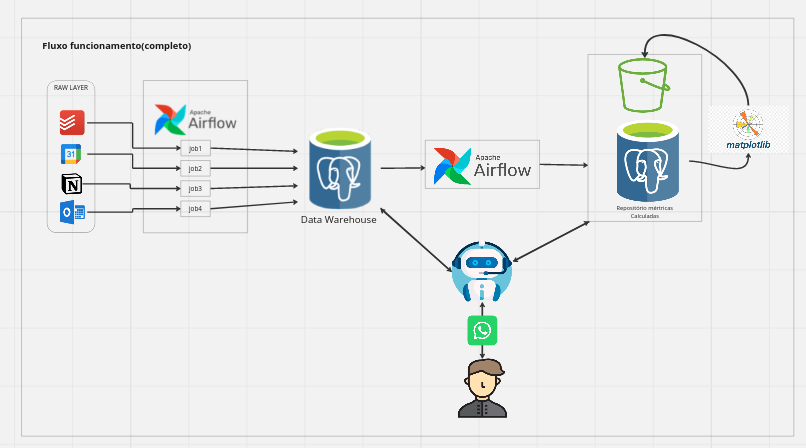
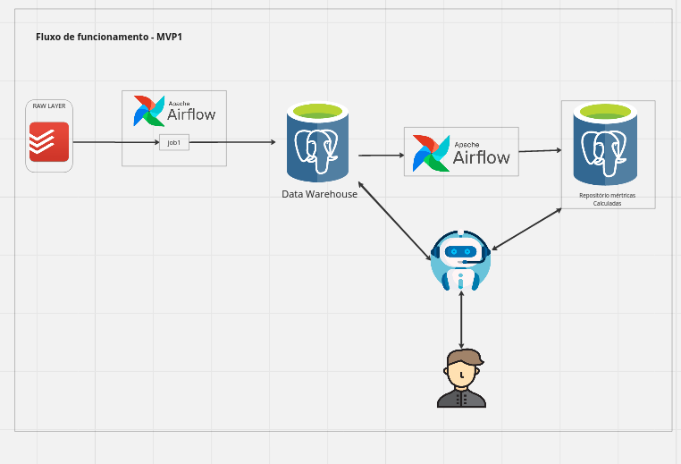

# 🤖 AIRoutineAssistant

This app were idealized to be an 🤖 AI assistant to your routine 🏋️‍♂️🥋.
Its mission is to assist the user to organize its routine, get a feeling about his productivity and even being up to date to the engagements, all these stuff on the user hand's palm through the WhatsApp 📱 :

Therefore this app will have the following features:

- Extract  Data from the main organization App like TodoIst, Google Calendar  or Notion
- process this data and load it into a Relational Database designed specially to get  user routine productivity metrics
- Calculate metrics from user's routine
- Generate Vizualization from user routine metrics
- Using a GenAI able to interact throug many source and give the routine information aspect of user from a simple text query

Actualy we are starting this ambitious app, and we're gonna develope the first MVP:

Our pupose is to enhance the app through iteraction and evoluting it along the sprints in order to take the most assertive decision until reach the final version.
